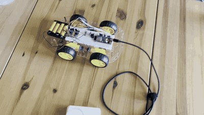
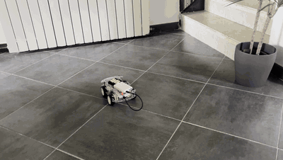

# J0

J0 is a 4-wheeled robot

## Mark 0

- The Mark 0 prototype is a 4-wheeled robot with a single motor per wheel.
- Two DRV8833 motor drivers are used to control the motors.
- The ESP32-S3 is used to control the motors and read the encoders.
- Robot can move forward and backward, turn left and right, and spin in place.



[See full video](docs/M0.mp4)

## Mark 1

- Added more maneuver commands: turn left and right, and spin in place.
- Added Wi-Fi control.
- Implemented simple cli client to control the robot.
- Added webrepl to update code wirelessly.
- Added wireless logging from the robot.
- Added simple HTML client to control the robot.

> With wifi controls and webrepl no need to physically connect to the robot. Both code and control are done wirelessly now :)



[See full video](docs/M1.mp4)

## Goal

The resulting physical architecture is exactly what I want to simulate:

```
                     ┌──────────────────────┐
                     │        Mac           │
                     │ ROS 2 Jazzy          │
                     │                      │
                     │ SLAM / Nav2          │
                     │ robot_state_pub      │
                     │ odometry fusion      │
                     └──────────┬───────────┘
                                │
                              Wi-Fi
                                │
                     ┌──────────▼───────────┐
                     │     ESP32-S3         │
                     │                      │
               ┌─────┤ wheel PID           ├─────┐
               │     │ encoder counting    │     │
               │     │ IMU                 │     │
               │     │ LiDAR bridge        │     │
               │     └──────────────────────┘     │
               ▼                                  ▼
           MDD3A                              LD19
          /     \
     motor L   motor R
        ↑         ↑
    encoder    encoder
```

And Gazebo will expose essentially the same interfaces:

```
             SIMULATION              REAL

/cmd_vel  → Gazebo drive        → ESP32 PID
/odom     ← Gazebo encoders     ← real encoders
/imu/data ← Gazebo IMU          ← MPU6050
/scan     ← Gazebo LiDAR        ← LD19

              ↓ same ↓

          SLAM Toolbox
              +
             Nav2
```

